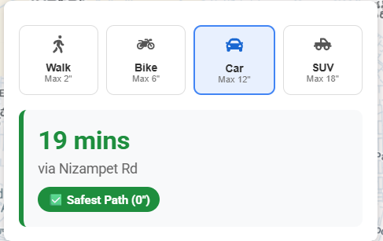
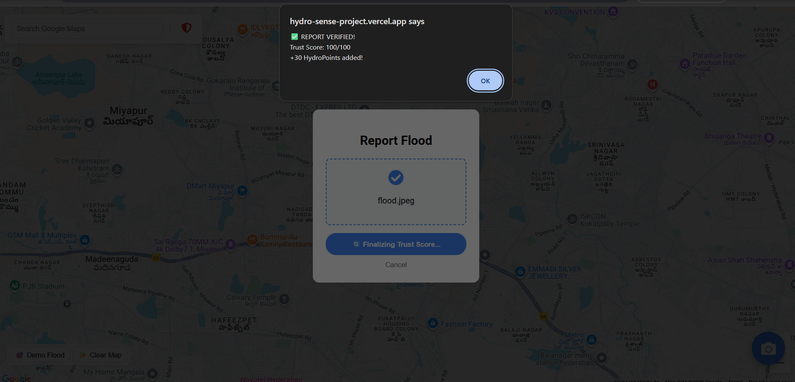
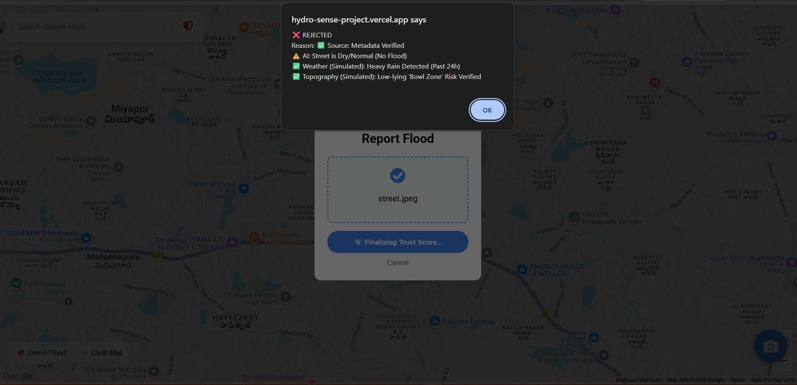
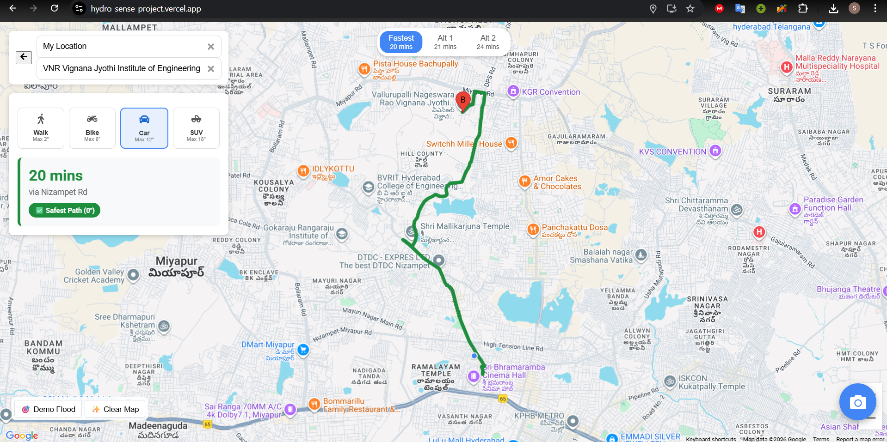
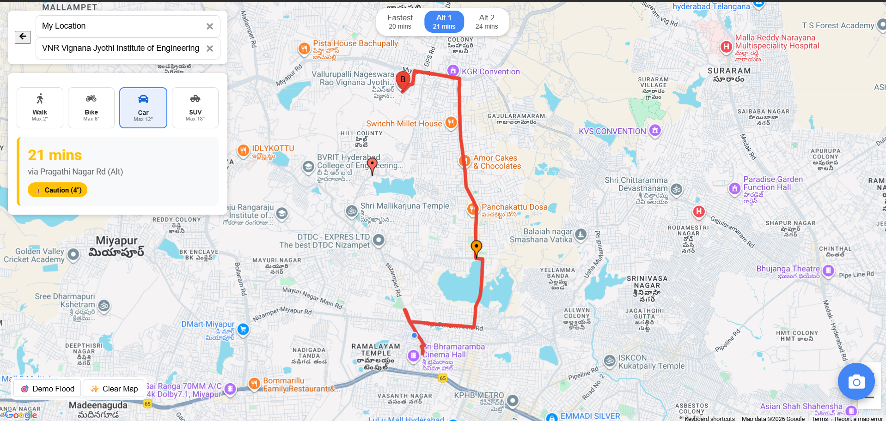

# **HydroSense \- AI-Powered Urban Flood Navigation 🌊🚗**

**Team Name:** AquaVerse

**Event:** Google Developer Group TechSprint

**Domain:** Sustainable Cities and Communities

## **🚀 Project Overview**

**HydroSense** is a safety-first navigation system designed to solve the critical issue of unsafe urban commuting during floods. Unlike standard navigation apps that only consider traffic and distance, HydroSense routes **physics**.

It combines **Multimodal AI (Gemini)**, **Geospatial Context**, and **Vehicle Intelligence** to guide users through the ***safest*** path, not just the fastest one. By analyzing real-time flood reports and determining **water depth**, HydroSense proactively **reroutes users** based on their specific vehicle's capability (Bike vs. Car vs. SUV).

## **💡 The Problem**

* **Invisible Danger:** Navigation apps often show flooded roads as "clear" because traffic data doesn't detect water depth.  
* **Vehicle Vulnerability:** A road passable for an SUV is often a death trap for a motorbike. Standard maps don't differentiate.  
* **Unreliable Reports:** Crowdsourced flood alerts are often outdated, vague, or fake.

## **🛡️ The HydroSense Solution**

1. **Vehicle-Specific Routing:** Automatically calculates risk based on vehicle type (e.g., rerouting bikes away from 1ft water, while alerting SUVs).  
2. **AI "Trust Engine":** Uses **Gemini 2.5 Flash** to analyze user photos, verify water presence, and estimate depth using reference objects (tires, curbs).  
3. **Dynamic Rerouting:** Instantly updates routes when a verified flood report blocks a path.  
4. **Multi-Layer Verification:** Cross-references visual data with Weather, Topography, and Historical patterns to prevent false alarms.

## **🏗️ Architecture & Tech Stack**

* **Frontend:** React.js, Google Maps JavaScript API  
* **Backend:** Node.js (Express), Gemini 2.5 Flash (Multimodal AI)  
* **Database:** Firebase Firestore (Real-time syncing)  
* **AI Model:** Google Gemini 2.5 Flash (Vision & Reasoning)  
* **APIs:** Google Maps (Directions, Places, Geocoding)

## **🔬 Hackathon Demo Strategy vs. Production**

Since this hackathon is taking place during the **Dry Season**, we cannot wait for a real flood to demonstrate the system's full capability. Therefore, we have implemented a **Hybrid Architecture** for the MVP:

### **1\. Visual AI (Real)**

* **What:** The image analysis is **100% Live & Real**.  
* **How:** We use Gemini 2.5 Flash to analyze uploaded photos. It detects water, estimates depth using visual cues (submerged tires, curbs), and rejects indoor/screen spoofs.

### **2\. Context Layer (Simulated for Demo)**

* **Weather Check:** In production, we ping the Open-Meteo API to confirm recent rainfall. For the demo, our backend simulates a "Heavy Rain" signal to allow report verification.  
* **Topography Check:** In production, we use Google Elevation API to verify if the location is a low-lying "Bowl Zone." For the demo, this geospatial check is simulated to validate the logic flow.  
* **Historical Data:** In production, we cross-reference Government Flood Reports. For the demo, we simulate a match with historical hotspots to showcase the "Confidence Boost" feature.

**Why?** This design enables judges to experience the entire end-to-end verification workflow from report submission to AI validation and safe rerouting  within a controlled, realistic demo environment.

## **🌐 Live Demo**

Web App: https://hydro-sense-project.vercel.app/

Backend API: https://hydrosense-project.onrender.com/

## **🛠️ Installation & Setup**

### **Prerequisites**

* Node.js & npm installed  
* Google Maps API Key (with Places, Directions, Geocoding enabled)  
* Google Gemini API Key  
* Firebase Project Credentials

### **1\. Clone the Repository**

git clone \[https://github.com/your-username/hydrosense-project.git\](https://github.com/your-username/hydrosense-project.git)  
cd hydrosense-project

### **2\. Backend Setup**

cd hydrosense-backend  
npm install  
\# Create a .env file and add: GEN\_AI\_KEY=your\_gemini\_key  
node server.js

### **3\. Frontend Setup**

cd hydrosense-web  
npm install  
\# Create a .env file and add:  
REACT\_APP\_GOOGLE\_MAPS\_KEY=your\_maps\_key REACT\_APP\_FIREBASE\_KEY=you\_firebase\_key  
npm start

## **📸 Key Features Walkthrough**

### **1\. The "Vehicle Selector"**

Switch between **Bike**, **Car**, and **SUV**. Watch the route safety badge change from **Green (Safe)** to **Red (Engine Risk)** instantly based on your vehicle's ground clearance.

### **2\. AI-Powered Reporting**

Upload a photo of a street. Our backend:

1. Verifies metadata (GPS).  
2. Sends it to **Gemini**.  
3. Gemini analyzes visual depth (e.g., "Water covers the curb").  
4. Returns a **Trust Score**.

**Valid Upload(Accepted)**

**Invalid Upload(Rejected)**

### **3\. Dynamic Rerouting**

If a verified report blocks the route, HydroSense prioritizes safer alternatives; if all available routes still carry flood risk, the system clearly surfaces the risk level and lets users make an informed decision.

**No Flood Points**

**Safe Rerouting During Flood Points**

## **🔮 Future Scope**

* **AR Flood Vision:** Use ARCore to visualize potential flood levels on your street before the rain starts.  
* **IoT Integration:** Connect with municipal water level sensors for hyper-local accuracy.  
* **Offline Mode:** Cache "Safe Corridors" for navigation during network blackouts.

## **🌍 Impact**

\- Reduces flood-related vehicle damage and accidents

\- Improves **emergency mobility** during **urban flooding**

\- Encourages **safer decision-making** through **transparent risk display**

